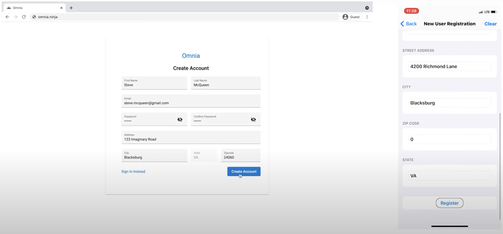
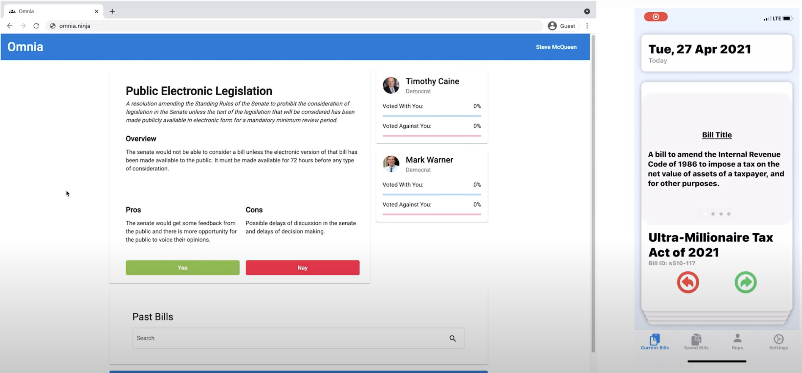
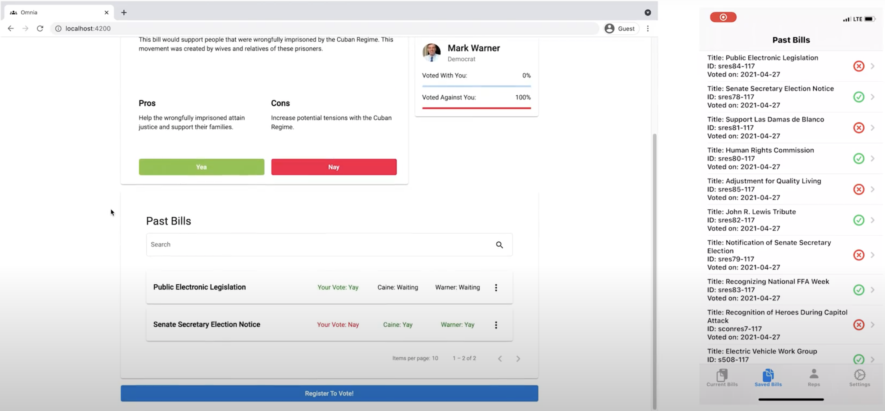
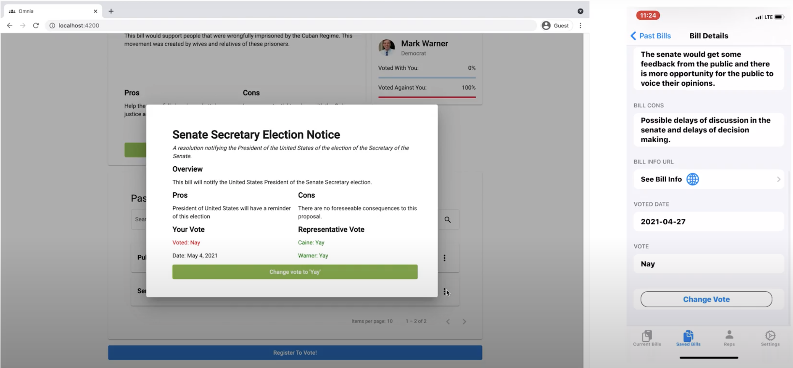
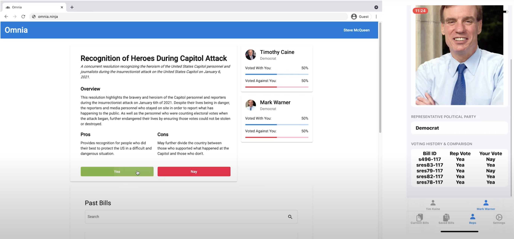

<div align="center">


</div>

## Overview
Congress must represent the people, and if they don't, it is our responsibility to remove them from their job. Omnia enables US citizens to do just that.

Users can follow their representatives, see the bills they are voting on, and compare their representative's votes to their own. If their representative isn't representing them anymore, their constituents will know.

## Features
For an MVP, the team implemented the following features:
1. Register & Login
2. Get a list of upcoming bills
3. Vote on a bill
4. View history of bills voted on and details for each
5. View representatives, their votes, and a comparison between their votes and the user's votes
6. Notify representative of user's votes

**View Gallery at the end for screenshots of the features**
## Install

### Backend
Go to the backend directory:
```
cd backend
```

Install dependencies:
```
npm install
```

### Frontend
Go to the backend directory:
```
cd web-app
```

Install dependencies:
```
npm install
```

## Run

### Backend
Start up server:
```
npm run dev
```

### Frontend
Start up server:
```
npm start
```

## Gallery





